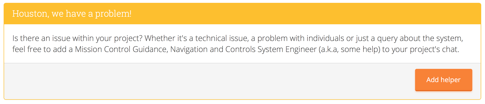
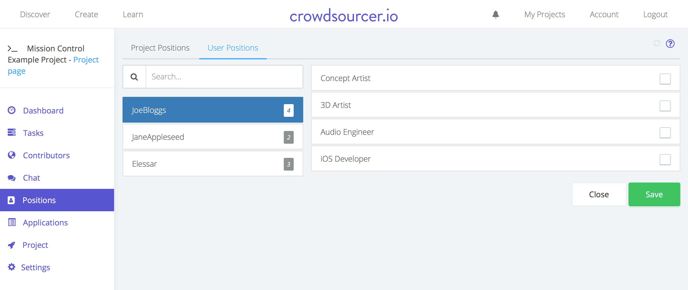

.. _for-creators:

Advice for Project Creators
============================

On this page you'll find some tips for if you're the creator of a project and are having some issues with members of you project.

General
---------

So you've got a problem with a contributor in your project. The first port of call is to try to reach out to them. Head to `your project's chat <https://chat.crowdsourcer.io>`_ and direct message the individual. If they've run off with something, invite them back and see if you can't continue where you left off, or if they're making threats, explain the lose-lose situation of going open source with the project, or having them removed from the project. Because Crowdsourcer.io is such a natural way of working, hopefully you'll be able to win them over with such reasoning.

Of course, if you need any external help either for mediation or advice, remember you can invite dedicated personnel into your project at the touch of a button by going to the chat page in your :ref:`mission_control` and pressing "Add helper" as below.

   
   You can add someone into your project's chat for any reason you may have, from mediating a dispute between members to technical support.

Member(s) distributing the product without authorisation
---------------------------------------------------------

If your product is being distributed against the consent of the entire project, the first thing to do is to try and reach out to and communicate with the individual(s) who have gone against the wishes of the rest of the team. This will open up amicable solutions that will hopefully allow you to continue where you left off, in good spirits.

Failing this further action can be taken such as removing the contributors positions (through :ref:`mission_control`), blocking access to external resources and getting in touch with third party vendors to take down any content/listings that have not been authorised.

To summarise:

- Attempt to communicate with individual(s)
- Remove positions of the contributor
- Block access to external assets
- Reach out to 3rd party retailers informing them of copyright infringement
- Go open source (temporarily)

.. note:: Please note that soon we'll have legal templates for you to use as well as a strong legal structure that protects *all* members of a project. This section will be updated when more information is available.

Member(s) accepting tasks against recommendation
---------------------------------------------------------

If there are contributors who are failing to communicate and are simply snapping up any available tasks before others have had a chance to look at them or against the recommendation of fellow contributors, there are several steps you can take to ensure the issue is resolved.

Speak with them
_________________

As always, there's a big emphasis on communication on Crowdsourcer.io. If possible message them in your project's chat and try to get a dialogue going. Of course, it's also worth inviting in a helper from Crowdsourcer.io (using the panic button from the chat page in Mission Control) to help mediate any situations.

Update your project's settings
________________________________

For the full article, see :ref:`project_settings`. From the settings page in Mission Control, you can reduce the number of active tasks a contributor can undertake at any one time. If the contributor in question has a low number of contribution points, perhaps switch to or lower the scaled limit to minimise the impact to other contributors. Otherwise, the solution may be to use or lower the flat limit. It's important to understand that changing these setting will affect all members of the project, including yourself.

Downvote reviews on low quality tasks
_______________________________________

Should any of the tasks be marked as completed and don't fulfil the desired criteria, you can downvote the task in review, or if it didn't go to review, flag the completed task as needing a review, from the tasks page in your project's Mission Control. For more information see :ref:`tasks_basics`.

Remove them from the position
______________________________

Should it come to it, you can remove the positions from the contributor. This will prevent them from undertaking any new tasks while you sort out any communication issues you may have with them. This should only be used as a last resort, as ideally, you'll have been able to solve the issue without preventing the contributor from contributing meaningfully to your project.

   
   You can unset all the positions of a contributor to prevent them from undertaking new tasks.

Group of members colluding on a project
---------------------------------------------------------

On very rare occasions groups of individuals may be accepted into your project who have applied with the intent of colluding and 'hijacking' the project. This could mean banding together and voting to approve low quality tasks, or in the worst of cases, taking your work and working on it themselves, privately. This can be avoided by properly vetting applicants and having larger numbers of contributors in your project from numerous sources. See: :ref:`before_accepting_applications` .

Should worst come to worst, however, some actions to take include:

- Prevent access to any third party accounts (Git repository, Google Drive etc.).
- Invite a helper from Crowdsourcer.io into your project's chat (through the chat page in Mission Control) and direct message them.
- Remove the positions of the members.
- If only voting collusion, edit voting settings, see: :ref:`project_settings`.